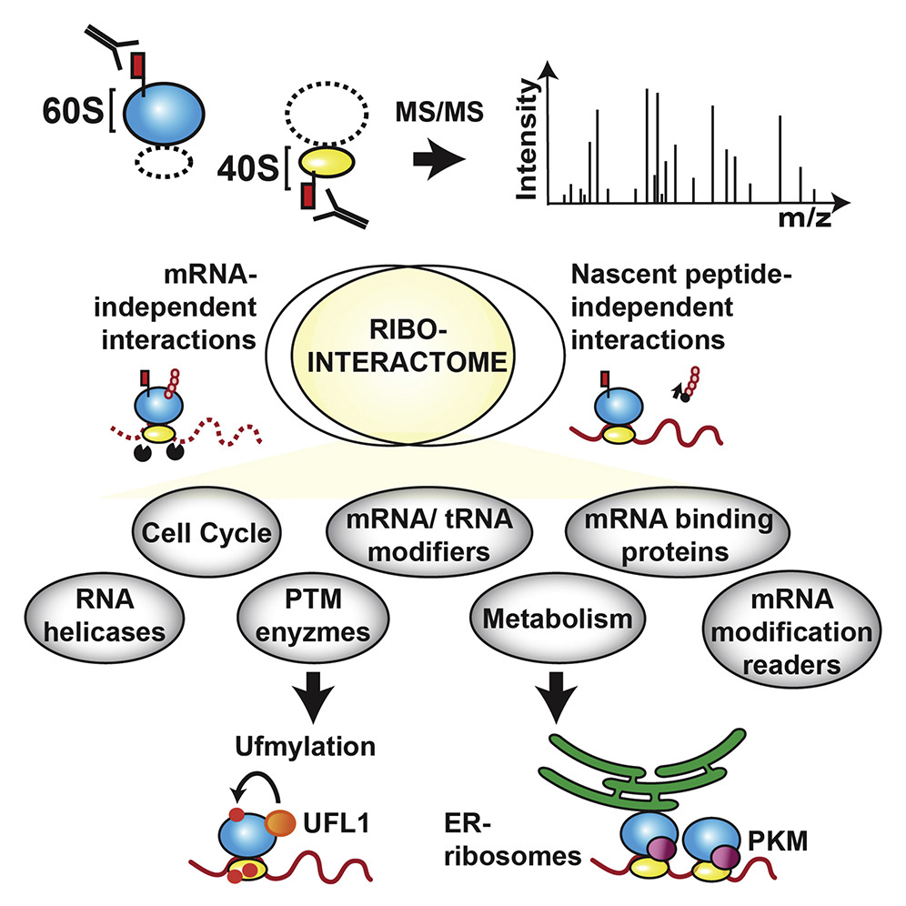

This repo accompanies the following manuscript:

Deniz Simsek, Gerald C. Tiu, Ryan A. Flynn, Gun Woo Byeon, Kathrin Leppek, Adele F. Xu, Howard Y. Chang, Maria Barna. The Mammalian Ribo-interactome Reveals Ribosome Functional Diversity and Heterogeneity.

It contains the code used to analyze quantitative proteomics data in the paper. 

```bibtex
@article{https://doi.org/10.1016/j.cell.2017.05.022},
  title={The Mammalian Ribo-interactome Reveals Ribosome Functional Diversity and Heterogeneity},
  author={Deniz Simsek, Gerald C. Tiu, Ryan A. Flynn, Gun Woo Byeon, Kathrin Leppek, Adele F. Xu, Howard Y. Chang, Maria Barna},
  journal={Cell},
  year={2017}
}
```




### Description
* empD.R reproduces analysis and plots in the paper
